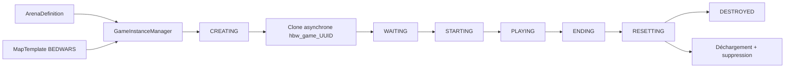
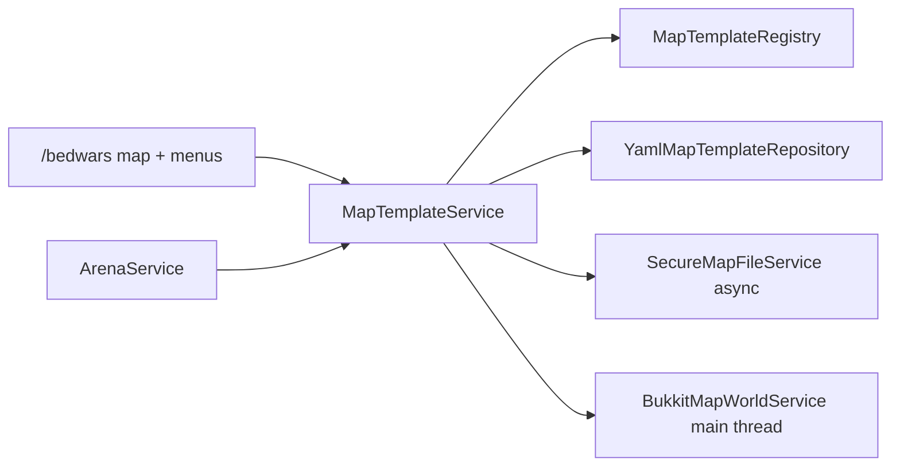
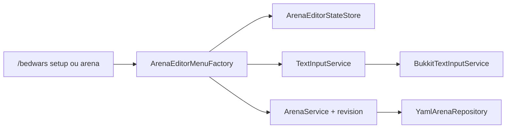
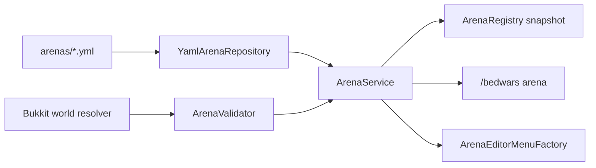
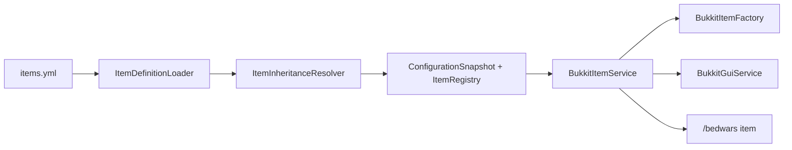
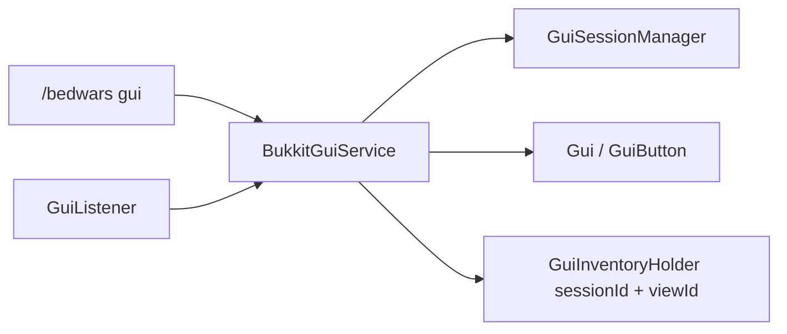
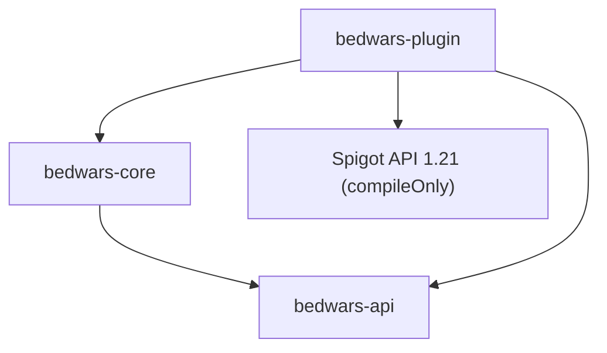

# Architecture actuelle

## Correctif runtime générateurs et boutiques

`ConfigurationDefaultsUpdater` fait évoluer `shops.yml` et `generators.yml` comme les autres ressources versionnées, avec sauvegarde et sans remplacement des valeurs existantes. `BukkitShopNpcService` ne conditionne plus l'existence physique du PNJ au nombre d'offres valides et répare les PNJ à `GameStartEvent` après chargement explicite du chunk.

`GeneratorPacingPolicy` applique à la frontière `PLAYING` un facteur `sqrt(équipes/joueurs)` borné par la configuration. `BukkitGameGeneratorAdapter` marque chaque drop par partie/générateur, ne fusionne que ces entités, les centre et les stabilise depuis le ticker partagé. `BukkitGeneratorHologramService` maintient les `TextDisplay` diamant/émeraude une fois par seconde à partir de `RuntimeGenerator.nextEmissionAt`; aucune tâche par générateur n'est créée.

## Ticket 014 — boutiques et achats runtime

`core.game.shop` contient le catalogue immuable, les offres, monnaies, catégories et `ShopPurchaseService`. Ce service vérifie l'appartenance, l'état `PLAYING`, le statut spectateur, le solde et la capacité avant de demander un échange atomique au port `ShopInventory`; un succès publie `ShopPurchaseEvent` sur le bus Java interne.

La frontière Bukkit charge un snapshot de `shops.yml`, adapte l'inventaire du joueur, affiche le menu catégorisé et crée les villageois runtime. Leur PDC porte l'UUID de partie et l'équipe; aucune apparence ou nom visible ne sert d'identité. La position du PNJ est une donnée administrative de `ArenaTeamDefinition`, tandis que l'entité n'existe que dans `hbw_game_*` et disparaît avec le clone.

## Ticket 013 — générateurs persistants et runtime

Le package `core.game.generator` contient les identifiants, ressources, règles immuables, échéances runtime et rapports de tick. `GameInstance` possède les `RuntimeGenerator` de son scope; ils ne sont ni globaux, ni persistés comme état vivant.

`ArenaGeneratorDefinition` est la source administrative persistée : sa position appartient au monde modèle. Au passage `GameWaitingEvent`, `BukkitGameGeneratorRegistry` copie les snapshots dans l'instance; les coordonnées sont ensuite appliquées au monde cloné par `BukkitGameGeneratorAdapter`. Aucune donnée runtime ne revient dans le YAML.

La clé d'occupation administrative est `(GeneratorResource, ArenaBlockPosition)`. Cette règle autorise plusieurs ressources différentes au même point tout en empêchant le doublon accidentel d'une même ressource. La capacité runtime reste calculée séparément par matériau.

`GameGeneratorService` ne crée aucune tâche. Le ticker Bukkit existant l'appelle une seule fois pour toutes les instances. Le service ignore les parties hors `PLAYING` ou sans monde actif, limite les émissions par passage et fait tourner son point de départ pour éviter qu'un générateur ne soit affamé. Une échéance très en retard produit au maximum une émission, puis saute directement à la prochaine date future. L'adaptateur compte et fusionne uniquement la ressource compatible dans un rayon borné, puis fractionne les nouveaux objets selon la taille maximale d'une pile Minecraft.

## Ticket 012 — lits et cycle d'élimination

`ArenaBedDefinition` décrit pied, tête et direction sans Bukkit; la position historique du pied reste lisible pour migration. `BukkitGameBedRegistry` vérifie les blocs du clone et remplit l'index O(1) de `GameInstance`. `GameBedService`, `GameDeathService`, `GameRespawnService` et `CombatTracker` portent les décisions pures. `BukkitGamePlayListener` adapte uniquement les événements de blocs, dégâts, mort, respawn et spectateur.

Le ticker unique du `GameLifecycleComponent` avance les respawns et la fin de partie. La victoire publie un événement interne, attend la durée configurée, restaure les snapshots et détruit le clone par le cycle existant.

## Correctif démarrage et présentation des équipes — 2026-07-17

`GameInstance.startLocation(UUID)` résout la relation runtime joueur → équipe → spawn sans dépendance Bukkit. Sur `GameStartEvent`, `BukkitGameDisplayService` demande cette destination et `BukkitRuntimePlayerGateway` charge le chunk du clone, vide les objets d'attente, passe le joueur en survie et le téléporte. Un spawn absent produit un message explicite et ne simule aucune mécanique BedWars.

La fiche GUI d'équipe conserve deux colonnes stables : spawn à gauche, lit à droite. Les six emplacements d'action restent visibles même lorsqu'une position manque; les boutons indisponibles expliquent la dépendance. Les clés visuelles et titres `v6` garantissent leur ajout aux installations existantes sans écraser les personnalisations antérieures.

## Correctif UX cartes et arènes — 2026-07-17

`ArenaEditorMenuFactory.editor` est une vue compacte de cinq lignes pilotée par `arena-editor.assistant-v5`. Elle affiche directement jusqu'à huit `ArenaTeamDefinition` colorées; un clic ouvre la fiche spawn/lit de l'équipe. La fiche revient à l'assistant principal. Les écrans joueurs et limites restent disponibles pour le diagnostic avancé, mais ne font plus partie du parcours essentiel.

`MapFileService` expose un dépôt d'import par identifiant validé, sans chemin arbitraire. `SecureMapFileService` confine ce dépôt sous `maps/templates/<id>/import`, refuse les liens symboliques et exige `level.dat`. `MapTemplateService.prepareImport` ferme le monde sur le thread Bukkit et conserve le verrou; `completeImportFiles` sauvegarde puis échange les dossiers hors thread; `finishImport` charge le nouveau monde, force le type `BEDWARS`, publie les métadonnées et libère le verrou. En cas d'échec de copie, le dossier précédent est restauré.

## Correctif de préparation Ticket 012 — configuration des équipes

`ArenaEditorMenuFactory` possède une vue liste et une fiche par `TeamId`; toutes les mutations continuent de passer par `ArenaService` avec la révision observée. Une sauvegarde réussie reconstruit la même fiche avec la nouvelle révision. `BukkitArenaBeds` reste à la frontière plugin : il transforme le bloc regardé en position normalisée du pied après vérification des deux moitiés. Le cœur refuse les doublons par coordonnées de bloc sans dépendre de Bukkit.

Les commandes avancées utilisent exactement les mêmes opérations métier. Leur complétion imbriquée est déléguée à `ArenaCommandHandler`, qui connaît les arènes, cartes, mondes et équipes actifs; aucun accès YAML n'est ajouté dans la commande ou le menu.

## Ticket 011 - équipes et parcours public

`ArenaTeamDefinition`, `TeamId` et `TeamColor` résident dans le cœur, sans type Bukkit. `ArenaDefinition` conserve les équipes détaillées et les anciens champs de capacité pour la compatibilité YAML. `GameInstance` en dérive des `RuntimeTeam` bornées; `GameInstanceManager.selectTeam` reste la frontière métier atomique.

`/bw` est une surface joueur : les arguments sont des ids publics de carte et `GameCommandHandler` choisit la meilleure instance disponible. Les UUID restent réservés aux actions administratives. `BukkitRuntimePlayerGateway` restaure le snapshot au quit/kick et le listener de cycle applique un nettoyage PDC défensif au join.

## Correctif 010.1 - accès, items runtime et affichage

`AdministrativeCommandPolicy` sépare `heneriabedwars.admin.*` de `heneriabedwars.game.join|leave`. Le dashboard possède sa permission dédiée. `RuntimeItemActionRegistry` valide action, main, état, UUID d'instance et cooldown avant que `GameWaitingListener` délègue à `GameLobbyService`. `GamePublicInfoMenuFactory` ne contient aucune navigation administrative.

`RuntimeScoreboardRenderer` rend les templates purs; `BukkitScoreboardSession` crée une fois objectif, équipes et entrées stables puis ne change que les préfixes modifiés. `ScoreboardNumberHider` adapte la capacité Paper par détection bornée et reste sans effet sur Spigot.

## Ticket 010 - lobby d'attente et compte a rebours

`bedwars-core/game/lobby` porte les cas d'usage d'entree, sortie, deconnexion et nettoyage; `bedwars-core/game/countdown` porte un compteur pur pilote par une seule tache de plateforme. `GameLobbyService` reste l'unique facade de pre-game pour commandes et menus et delegue les transitions a `GameInstanceManager`.

`bedwars-plugin/game` contient les frontieres Bukkit : `BukkitPlayerSnapshotService`, `BukkitRuntimePlayerGateway`, `GameWaitingListener`, `BukkitGameDisplayService`, `GameAdminMenuFactory` et `GameLifecycleComponent`. Les snapshots ne quittent jamais la memoire, les listeners sont limites aux membres `WAITING` ou `STARTING`, et le bus interne est replanifie sur le thread serveur avant tout affichage Bukkit.

## Ticket 009 — moteur d'instances

`bedwars-api/game` expose seulement des snapshots immuables via `GameApi`, `PlayerGameApi` et `ArenaGameApi`. `bedwars-core/game` contient `GameInstance`, `GameInstanceManager`, `RuntimeArena`, `RuntimePlayer`, `RuntimeTeam`, la machine d'état, les index et le bus d'événements interne. `bedwars-plugin/game` adapte la copie de fichiers, `WorldCreator`, les téléportations, commandes et événements de déconnexion.

Les ports `RuntimeWorldService` et `RuntimePlayerGateway` peuvent recevoir plus tard des adaptateurs proxy, matchmaking ou orchestration réseau. Ils ne contiennent aucune dépendance SQL/Redis et ne promettent aucune persistance de partie.

## Ticket 008 — éditeur graphique des cartes

Le domaine pur contient préférences de vue, progression, validation, suivi d'opération et réglages persistants. `bedwars-plugin` adapte uniquement les événements Bukkit, mondes, inventaires et tâches asynchrones. Les menus délèguent aux services; le câblage différé `MapMenuNavigation` évite une dépendance circulaire entre tableau de bord, éditeur d'arènes et éditeur de cartes.

## Ticket 007 — cartes modèles autonomes

`bedwars-core/map` contient les identifiants confinés, modèle immutable, états transitoires, registre copy-on-write, verrou par carte, validation et services. `bedwars-plugin/map` adapte les métadonnées YAML, les fichiers, le générateur vide, Bukkit, commandes, menus et cycle de vie. Aucun type Bukkit ne traverse la frontière du cœur.

Une création n'est publiée qu'après création du monde et persistance des métadonnées. Les appels Bukkit de chargement, sauvegarde, déchargement et téléportation restent sur le thread serveur. La duplication, la sauvegarde de suppression et l'effacement confiné s'exécutent hors thread. La suppression est scindée en préparation Bukkit puis phase fichier, avec un même verrou jusqu'au résultat final.

Les définitions d'arènes sont la source de vérité des associations. Les liens inverses dans les métadonnées de cartes sont dérivés et resynchronisés au chargement. `ArenaValidator` exige une carte existante, de type `BEDWARS` et hors état `ERROR` pour les nouvelles arènes liées.

## Ticket 006 — éditeur administratif d'arènes

`ArenaEditorMenuFactory` compose le menu principal, `ArenaListGui`, l'éditeur, la validation, la sélection du monde et les sous-menus joueurs, équipes et limites au moyen du modèle GUI interne. Ces noms décrivent des vues produites par la factory, pas des classes publiques séparées. Les actions appellent toutes le même `ArenaService` que les commandes et ne lisent jamais les YAML.

`TextInputService` est la frontière pure du cœur. `TextInputManager` conserve une session bornée par UUID et `BukkitTextInputService` intercepte le chat, l'annule avant diffusion, puis replanifie la validation sur le thread serveur. Déconnexion, kick, timeout et arrêt nettoient les sessions. `ArenaEditorStateStore` conserve filtre, tri, page et révisions observées sans conserver de `Player`.

Chaque mutation sauvegarde avant de publier le nouveau snapshot et incrémente la révision. Une action issue d'une vue obsolète reçoit `CONFLICT` et doit rafraîchir l'éditeur. Les téléportations sont confinées à l'adaptateur Bukkit et exigent `heneriabedwars.admin.arena.teleport`.

## Ticket 005 — définitions d'arènes

`bedwars-core/arena` contient les identifiants sûrs, positions pures, définition immutable, statuts administratifs, diagnostics, validation, registre, port de persistance et cas d'usage. `bedwars-plugin/arena` adapte les mondes Bukkit, YAML UTF-8, commandes et menus. `ArenaService` est enregistré dans `ServiceRegistry` et chargé par `ArenaLifecycleComponent`.

Une mutation n'est publiée dans le registre qu'après sauvegarde atomique réussie. Au reload, chaque fichier valide remplace sa définition ; un fichier illisible dont l'id est connu conserve l'ancienne valeur. Une suppression copie d'abord le YAML sous `backups/arenas/<date>/`. Les statuts `DRAFT/READY/ENABLED/DISABLED/INVALID/ERROR` sont distincts des futurs états de partie.

## Ticket 004 — items configurables

`bedwars-core/item` contient clés, textes, contexte, définitions/templates immuables, registre et résolveur d'héritage sans Bukkit. `bedwars-plugin/item` charge et valide `items.yml`, construit des `ItemStack` neufs, applique les métadonnées/PDC et fournit `ItemService` au GUI et aux commandes. `ConfigurationSnapshot` contient le registre : le même échange atomique active configuration, langues et items, ou conserve l'ancien ensemble.

## Ticket 003 — framework GUI

Le cœur contient le modèle GUI pur, les sessions, la navigation, la pagination, les confirmations, les slots et l'exécuteur d'actions. Le module plugin contient `BukkitGuiService`, `GuiInventoryHolder`, `GuiListener`, le rendu d'items, les sons et la démonstration. `GuiService` est enregistré dans `ServiceRegistry` et `BukkitGuiService` participe au cycle de vie.

## Ticket 002 — configuration et localisation

`bedwars-core` contient les documents immuables, records de réglages, problèmes typés, registre, snapshot, clés de traduction, placeholders et rendu de messages sans Bukkit. `bedwars-plugin` contient l'installation des ressources, `YamlConfiguration`, la validation des matériaux, les écritures sûres, sauvegardes et le `ConfigurationService`.

Le flux est : fichiers disque → documents temporaires → validation croisée → records Java et catalogues → `ConfigurationSnapshot` → unique échange atomique. Le registre n'est activé qu'après le snapshot. Les commandes lisent exclusivement le snapshot courant et ne voient donc jamais un état partiel.

La classe principale compose le service avant le bootstrap, puis injecte le même service dans la commande. Aucun singleton global n'a été ajouté.

## Modules et dépendances

- `bedwars-api` contient les contrats publics et ne dépend d'aucun autre module ni de Paper.
- `bedwars-core` contient les abstractions de journalisation, services, cycle de vie, modèles de configuration et rendu des messages. Il dépend uniquement de `bedwars-api`.
- `bedwars-plugin` contient la classe Bukkit, le bootstrap, les entrées/sorties YAML, l'adaptateur de logs et les commandes. Il dépend de l'API, du cœur et compile contre Spigot API sans l'embarquer. Le même JAR cible Paper 1.21.x.

## Construction et démarrage

Le package racine est `fr.heneria.bedwars`. `HeneriaBedWarsPlugin` initialise `ConfigurationService`, construit `BedWarsBootstrap`, démarre le cycle de vie puis enregistre la commande. Le bootstrap joue le rôle de composition root : il possède un `ServiceRegistry`, expose l'API minimale et délègue l'ordre de démarrage à `LifecycleManager`.

Le gestionnaire démarre les composants dans l'ordre fourni et les arrête en ordre inverse. Un échec de démarrage déclenche le rollback des composants déjà lancés. Le registre refuse les doublons, fournit `require` pour les services obligatoires et `find` pour les absences normales.

Bukkit reste confiné à `bedwars-plugin`. Les snapshots, traductions, couleurs et placeholders restent purs dans `bedwars-core`; l'accès YAML, la validation `Material` et les `CommandSender` résident dans l'adaptateur. Toute future logique de partie doit être conçue dans le cœur avec des ports explicites, puis adaptée à la plateforme. Le document historique `docs/ARCHITECTURE.md` décrit une cible plus ambitieuse ; il ne représente pas le code actuellement livré.
