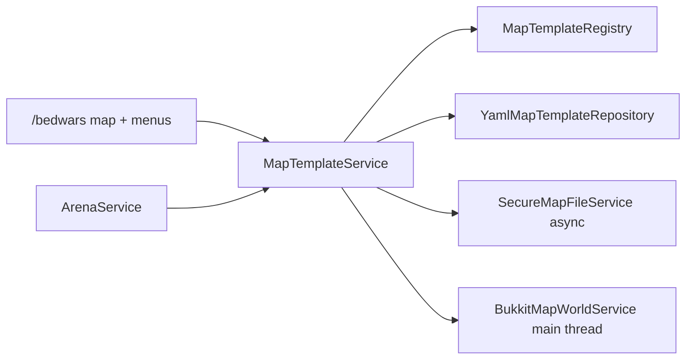
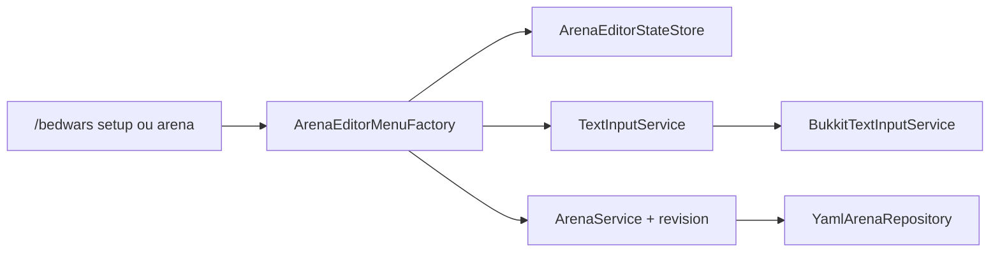
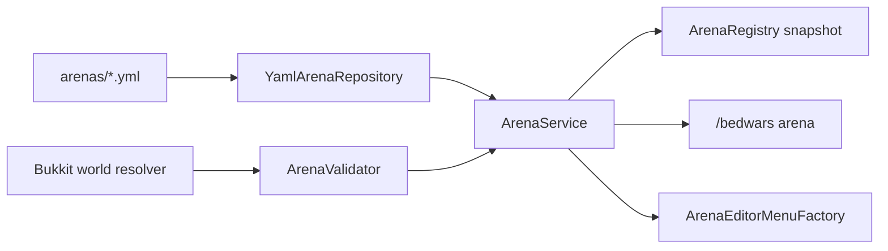
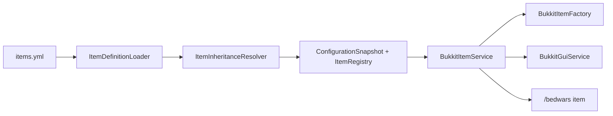
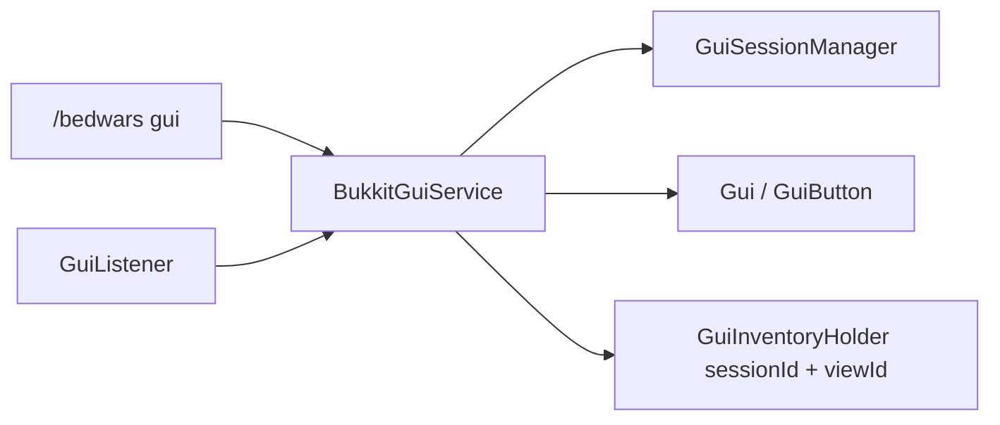
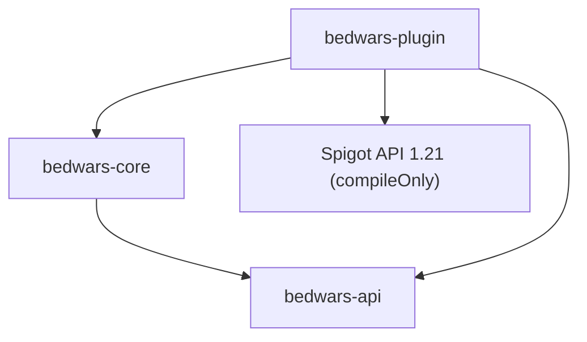

# Architecture actuelle

## Ticket 007 — cartes modèles autonomes

`bedwars-core/map` contient les identifiants confinés, modèle immutable, états transitoires, registre copy-on-write, verrou par carte, validation et services. `bedwars-plugin/map` adapte les métadonnées YAML, les fichiers, le générateur vide, Bukkit, commandes, menus et cycle de vie. Aucun type Bukkit ne traverse la frontière du cœur.

Une création n'est publiée qu'après création du monde et persistance des métadonnées. Les appels Bukkit de chargement, sauvegarde, déchargement et téléportation restent sur le thread serveur. La duplication, la sauvegarde de suppression et l'effacement confiné s'exécutent hors thread. La suppression est scindée en préparation Bukkit puis phase fichier, avec un même verrou jusqu'au résultat final.

Les définitions d'arènes sont la source de vérité des associations. Les liens inverses dans les métadonnées de cartes sont dérivés et resynchronisés au chargement. `ArenaValidator` exige une carte existante, de type `BEDWARS` et hors état `ERROR` pour les nouvelles arènes liées.

## Ticket 006 — éditeur administratif d'arènes

`ArenaEditorMenuFactory` compose le menu principal, `ArenaListGui`, l'éditeur, la validation, la sélection du monde et les sous-menus joueurs, équipes et limites au moyen du modèle GUI interne. Ces noms décrivent des vues produites par la factory, pas des classes publiques séparées. Les actions appellent toutes le même `ArenaService` que les commandes et ne lisent jamais les YAML.

`TextInputService` est la frontière pure du cœur. `TextInputManager` conserve une session bornée par UUID et `BukkitTextInputService` intercepte le chat, l'annule avant diffusion, puis replanifie la validation sur le thread serveur. Déconnexion, kick, timeout et arrêt nettoient les sessions. `ArenaEditorStateStore` conserve filtre, tri, page et révisions observées sans conserver de `Player`.

Chaque mutation sauvegarde avant de publier le nouveau snapshot et incrémente la révision. Une action issue d'une vue obsolète reçoit `CONFLICT` et doit rafraîchir l'éditeur. Les téléportations sont confinées à l'adaptateur Bukkit et exigent `heneriabedwars.admin.arena.teleport`.

## Ticket 005 — définitions d'arènes

`bedwars-core/arena` contient les identifiants sûrs, positions pures, définition immutable, statuts administratifs, diagnostics, validation, registre, port de persistance et cas d'usage. `bedwars-plugin/arena` adapte les mondes Bukkit, YAML UTF-8, commandes et menus. `ArenaService` est enregistré dans `ServiceRegistry` et chargé par `ArenaLifecycleComponent`.

Une mutation n'est publiée dans le registre qu'après sauvegarde atomique réussie. Au reload, chaque fichier valide remplace sa définition ; un fichier illisible dont l'id est connu conserve l'ancienne valeur. Une suppression copie d'abord le YAML sous `backups/arenas/<date>/`. Les statuts `DRAFT/READY/ENABLED/DISABLED/INVALID/ERROR` sont distincts des futurs états de partie.

## Ticket 004 — items configurables

`bedwars-core/item` contient clés, textes, contexte, définitions/templates immuables, registre et résolveur d'héritage sans Bukkit. `bedwars-plugin/item` charge et valide `items.yml`, construit des `ItemStack` neufs, applique les métadonnées/PDC et fournit `ItemService` au GUI et aux commandes. `ConfigurationSnapshot` contient le registre : le même échange atomique active configuration, langues et items, ou conserve l'ancien ensemble.

## Ticket 003 — framework GUI

Le cœur contient le modèle GUI pur, les sessions, la navigation, la pagination, les confirmations, les slots et l'exécuteur d'actions. Le module plugin contient `BukkitGuiService`, `GuiInventoryHolder`, `GuiListener`, le rendu d'items, les sons et la démonstration. `GuiService` est enregistré dans `ServiceRegistry` et `BukkitGuiService` participe au cycle de vie.

## Ticket 002 — configuration et localisation

`bedwars-core` contient les documents immuables, records de réglages, problèmes typés, registre, snapshot, clés de traduction, placeholders et rendu de messages sans Bukkit. `bedwars-plugin` contient l'installation des ressources, `YamlConfiguration`, la validation des matériaux, les écritures sûres, sauvegardes et le `ConfigurationService`.

Le flux est : fichiers disque → documents temporaires → validation croisée → records Java et catalogues → `ConfigurationSnapshot` → unique échange atomique. Le registre n'est activé qu'après le snapshot. Les commandes lisent exclusivement le snapshot courant et ne voient donc jamais un état partiel.

La classe principale compose le service avant le bootstrap, puis injecte le même service dans la commande. Aucun singleton global n'a été ajouté.

## Modules et dépendances

- `bedwars-api` contient les contrats publics et ne dépend d'aucun autre module ni de Paper.
- `bedwars-core` contient les abstractions de journalisation, services, cycle de vie, modèles de configuration et rendu des messages. Il dépend uniquement de `bedwars-api`.
- `bedwars-plugin` contient la classe Bukkit, le bootstrap, les entrées/sorties YAML, l'adaptateur de logs et les commandes. Il dépend de l'API, du cœur et compile contre Spigot API sans l'embarquer. Le même JAR cible Paper 1.21.x.

## Construction et démarrage

Le package racine est `fr.heneria.bedwars`. `HeneriaBedWarsPlugin` initialise `ConfigurationService`, construit `BedWarsBootstrap`, démarre le cycle de vie puis enregistre la commande. Le bootstrap joue le rôle de composition root : il possède un `ServiceRegistry`, expose l'API minimale et délègue l'ordre de démarrage à `LifecycleManager`.

Le gestionnaire démarre les composants dans l'ordre fourni et les arrête en ordre inverse. Un échec de démarrage déclenche le rollback des composants déjà lancés. Le registre refuse les doublons, fournit `require` pour les services obligatoires et `find` pour les absences normales.

Bukkit reste confiné à `bedwars-plugin`. Les snapshots, traductions, couleurs et placeholders restent purs dans `bedwars-core`; l'accès YAML, la validation `Material` et les `CommandSender` résident dans l'adaptateur. Toute future logique de partie doit être conçue dans le cœur avec des ports explicites, puis adaptée à la plateforme. Le document historique `docs/ARCHITECTURE.md` décrit une cible plus ambitieuse ; il ne représente pas le code actuellement livré.
