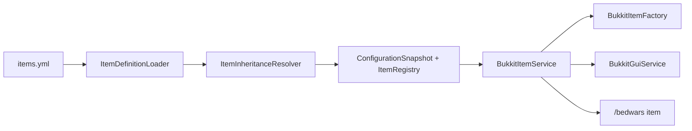
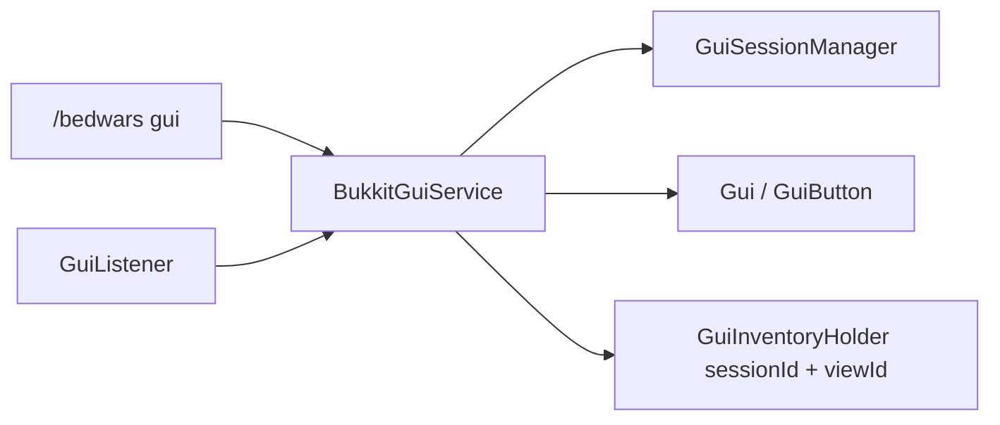
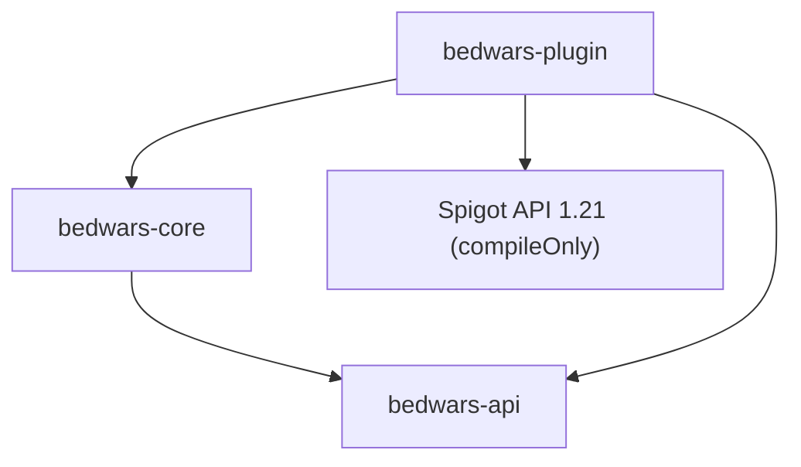

# Architecture actuelle

## Ticket 004 — items configurables

`bedwars-core/item` contient clés, textes, contexte, définitions/templates immuables, registre et résolveur d'héritage sans Bukkit. `bedwars-plugin/item` charge et valide `items.yml`, construit des `ItemStack` neufs, applique les métadonnées/PDC et fournit `ItemService` au GUI et aux commandes. `ConfigurationSnapshot` contient le registre : le même échange atomique active configuration, langues et items, ou conserve l'ancien ensemble.

## Ticket 003 — framework GUI

Le cœur contient le modèle GUI pur, les sessions, la navigation, la pagination, les confirmations, les slots et l'exécuteur d'actions. Le module plugin contient `BukkitGuiService`, `GuiInventoryHolder`, `GuiListener`, le rendu d'items, les sons et la démonstration. `GuiService` est enregistré dans `ServiceRegistry` et `BukkitGuiService` participe au cycle de vie.

## Ticket 002 — configuration et localisation

`bedwars-core` contient les documents immuables, records de réglages, problèmes typés, registre, snapshot, clés de traduction, placeholders et rendu de messages sans Bukkit. `bedwars-plugin` contient l'installation des ressources, `YamlConfiguration`, la validation des matériaux, les écritures sûres, sauvegardes et le `ConfigurationService`.

Le flux est : fichiers disque → documents temporaires → validation croisée → records Java et catalogues → `ConfigurationSnapshot` → unique échange atomique. Le registre n'est activé qu'après le snapshot. Les commandes lisent exclusivement le snapshot courant et ne voient donc jamais un état partiel.

La classe principale compose le service avant le bootstrap, puis injecte le même service dans la commande. Aucun singleton global n'a été ajouté.

## Modules et dépendances

- `bedwars-api` contient les contrats publics et ne dépend d'aucun autre module ni de Paper.
- `bedwars-core` contient les abstractions de journalisation, services, cycle de vie, modèles de configuration et rendu des messages. Il dépend uniquement de `bedwars-api`.
- `bedwars-plugin` contient la classe Bukkit, le bootstrap, les entrées/sorties YAML, l'adaptateur de logs et les commandes. Il dépend de l'API, du cœur et compile contre Spigot API sans l'embarquer. Le même JAR cible Paper 1.21.x.

## Construction et démarrage

Le package racine est `fr.heneria.bedwars`. `HeneriaBedWarsPlugin` initialise `ConfigurationService`, construit `BedWarsBootstrap`, démarre le cycle de vie puis enregistre la commande. Le bootstrap joue le rôle de composition root : il possède un `ServiceRegistry`, expose l'API minimale et délègue l'ordre de démarrage à `LifecycleManager`.

Le gestionnaire démarre les composants dans l'ordre fourni et les arrête en ordre inverse. Un échec de démarrage déclenche le rollback des composants déjà lancés. Le registre refuse les doublons, fournit `require` pour les services obligatoires et `find` pour les absences normales.

Bukkit reste confiné à `bedwars-plugin`. Les snapshots, traductions, couleurs et placeholders restent purs dans `bedwars-core`; l'accès YAML, la validation `Material` et les `CommandSender` résident dans l'adaptateur. Toute future logique de partie doit être conçue dans le cœur avec des ports explicites, puis adaptée à la plateforme. Le document historique `docs/ARCHITECTURE.md` décrit une cible plus ambitieuse ; il ne représente pas le code actuellement livré.
