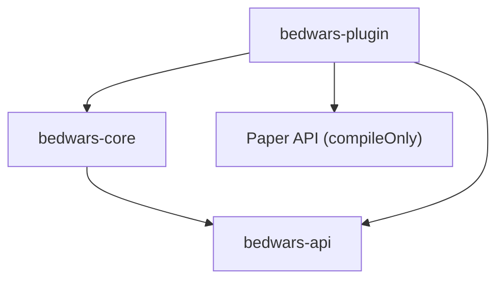

# Architecture actuelle

## Modules et dépendances

- `bedwars-api` contient les contrats publics et ne dépend d'aucun autre module ni de Paper.
- `bedwars-core` contient les abstractions de journalisation, le registre de services et le cycle de vie. Il dépend uniquement de `bedwars-api`.
- `bedwars-plugin` contient la classe Paper, le bootstrap, la configuration, l'adaptateur de logs et la commande de diagnostic. Il dépend de l'API, du cœur et compile contre Paper sans l'embarquer.

## Construction et démarrage

Le package racine est `fr.heneria.bedwars`. `HeneriaBedWarsPlugin` charge la configuration, construit `BedWarsBootstrap`, démarre le cycle de vie puis enregistre la commande. Le bootstrap joue le rôle de composition root : il possède un `ServiceRegistry`, expose l'API minimale et délègue l'ordre de démarrage à `LifecycleManager`.

Le gestionnaire démarre les composants dans l'ordre fourni et les arrête en ordre inverse. Un échec de démarrage déclenche le rollback des composants déjà lancés. Le registre refuse les doublons, fournit `require` pour les services obligatoires et `find` pour les absences normales.

Paper reste confiné à `bedwars-plugin`. Toute future logique de partie doit être conçue dans le cœur avec des ports explicites, puis adaptée à Paper. Le document historique `docs/ARCHITECTURE.md` décrit une cible plus ambitieuse ; il ne représente pas le code actuellement livré.
