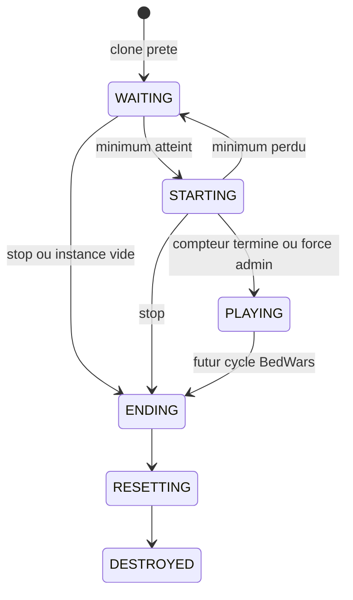
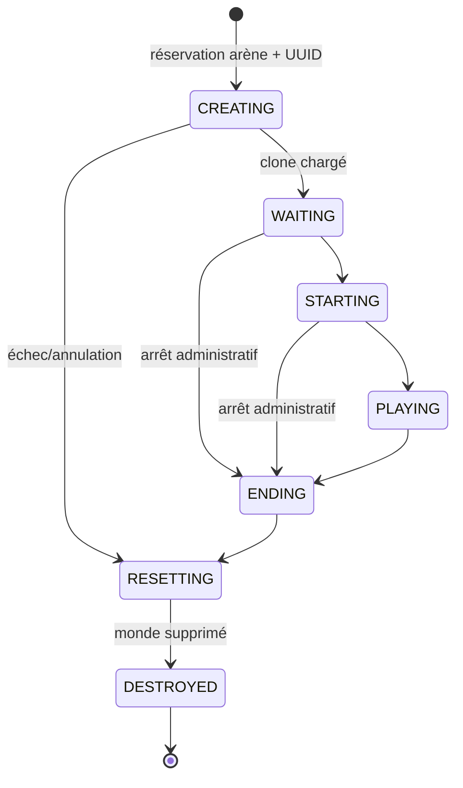

# Cycle des parties

## Lobby et compte a rebours Ticket 010



Le joueur rejoint au point d'attente, recoit son inventaire temporaire et un affichage de statut. Quitter restaure son snapshot. A la fin du compteur, l'inventaire d'attente et les affichages sont retires mais aucune logique BedWars n'est encore lancee.

## Socle runtime Ticket 009



Le Ticket 009 n'automatise pas encore `STARTING`, `PLAYING` ou `ENDING`; il garantit uniquement que ces transitions existent et qu'aucun appel ne peut les contourner. Les futurs countdown, règles BedWars et conditions de victoire piloteront cette machine via le manager.

Le cycle cible envisagé est :

```text
DISABLED -> WAITING -> STARTING -> PLAYING -> ENDING -> RESETTING
                                                    \-> ERROR
```

Ces états ne sont pas implémentés. Leur définition exacte, les transitions autorisées, l'idempotence et la récupération d'erreur devront être couvertes par des tests avant toute utilisation.

Les statuts administratifs d'une définition (`DRAFT`, `READY`, `ENABLED`, `DISABLED`, `INVALID`, `ERROR`) sont implémentés depuis le Ticket 005 mais ne font pas partie de ce cycle. `ENABLED` signifie seulement « autorisée pour un futur gestionnaire de parties ».

Le Ticket 006 permet de modifier et valider ces statuts depuis les menus. L'activation refuse une définition invalide et ne démarre toujours aucune partie, ne clone aucun monde et ne crée aucune équipe runtime.

Le Ticket 007 ajoute des cartes modèles persistantes et leur association aux arènes, pas des instances de match. Un futur passage vers `WAITING` devra copier une carte `BEDWARS` vers une instance isolée, ne jamais faire jouer directement dans le modèle, puis supprimer ou réinitialiser cette instance à la fin. Aucun de ces changements d'état n'est encore implémenté.
