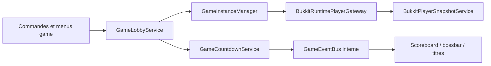

# Runtime des parties et lobby d'attente

## Ticket 012 — cycle jouable

Pendant `PLAYING`, `GameBedService` protège le lit allié et attribue une seule destruction ennemie. Une mort consulte l'état du lit au moment exact de la décision : lit vivant, le joueur passe spectateur temporaire et réapparaît; lit détruit, il devient spectateur définitif. Les respawns sont des données de `RuntimePlayer` avancées chaque seconde, sans tâche individuelle.

Une équipe sans membre actif ou en respawn est éliminée. Lorsqu'une seule équipe ayant réellement participé reste, la partie passe en `ENDING`; après `game.ending.duration-seconds`, le service de lobby restaure les joueurs et détruit l'instance. Déconnexion en jeu signifie élimination immédiate tant que la reconnexion n'existe pas.

## Positionnement au démarrage

À la transition `STARTING → PLAYING`, le joueur quitte le point d'attente et rejoint le spawn de son `RuntimeTeam` dans `hbw_game_<UUID>`. Le chunk cible est chargé avant la téléportation et les objets d'attente sont retirés. Un spawn manquant est signalé sans déplacer arbitrairement le joueur. Cette étape ne constitue pas encore le gameplay des lits et éliminations.

## Correctif 010.1

Chaque item d'attente contient une action stable et l'UUID complet de la partie. Le listener accepte les clics gauche/droit dans l'air ou sur bloc même si l'interaction vanilla est déjà annulée, ignore l'off-hand, applique un cooldown et refuse un ancien UUID. Quitter appelle exclusivement `GameLobbyService.leave`; informations ouvre un GUI public purement informatif, sans bouton de départ redondant.

Le scoreboard utilise les templates `waiting` ou `starting`, rend les états localisés et conserve une session par joueur. Les équipes/entrées restent stables afin d'éviter le clignotement. Paper peut masquer les nombres via sa capacité `NumberFormat.blank`; Spigot conserve les scores avec un fallback compatible.

## Ticket 010

Une arene active est transformee par `GameInstanceManager` en monde clone jetable puis en `GameInstance`. Le Ticket 010 ajoute la couche d'attente au-dessus de ce moteur, sans introduire de lit, generateur, boutique, combat ou condition de victoire.



## Etats et transitions

```text
CREATING -> WAITING -> STARTING -> PLAYING -> ENDING -> RESETTING -> DESTROYED
                       |
                       +-> WAITING (minimum de joueurs perdu)
```

- `WAITING` est le lobby de la partie.
- `STARTING` est un compte a rebours actif.
- `PLAYING` est atteint mais ne declenche volontairement aucun gameplay BedWars au Ticket 010.
- Les transitions restent centralisees dans `GameInstanceManager`; une commande, un menu ou un listener ne modifie jamais directement l'etat.

## Joueur dans un lobby de partie

Avant la teleportation, `BukkitPlayerSnapshotService` conserve uniquement en memoire : position, mode de jeu, inventaire, armure, main secondaire, niveau, experience, sante, faim, effets, vol, vitesses et scoreboard. Le retour restaure cet etat puis oublie le snapshot. Si le monde d'origine n'existe plus, le monde de secours configure est utilise. Si cette restauration echoue, le resultat explicite `RESTORE_FAILED` est retourne et le snapshot reste disponible pour diagnostic.

Dans `WAITING` et `STARTING` uniquement, le listener protege le joueur : degats, faim, blocs, inventaire, craft, drop/pickup, echange de main et combustion sont bloques. Une chute sous `game.waiting.void-rescue-y` replace le joueur au point d'attente avec un court cooldown. Les items configurables `game.waiting.leave` et `game.waiting.info` restent les seuls gestes joueur necessaires.

Une deconnexion retire le joueur de l'instance et abandonne son snapshot en memoire : aucune restauration offline ni reconnexion runtime n'est simulee.

## Compte a rebours et nettoyage

Une seule tache Bukkit centrale pilote le runtime. Chaque seconde elle fait avancer les countdowns et verifie les instances vides; a la cadence configuree elle rafraichit les scoreboards. Il n'existe pas une tache par joueur ou par partie.

- lorsque le minimum de l'arene est atteint, `GameCountdownService` fait `WAITING -> STARTING`;
- si le minimum redescend, le compte a rebours est annule et revient a `WAITING`;
- une partie pleine peut etre acceleree selon `game.yml`;
- le compteur termine fait `STARTING -> PLAYING`;
- une instance vide est detruite apres `empty-destroy-delay-seconds`;
- l'arret plugin bloque les joins, annule les compteurs, retire les affichages puis demande le nettoyage des instances.

Les evenements `PlayerGameJoinEvent`, `PlayerGameLeaveEvent`, `GameCountdownStartEvent`, `GameCountdownTickEvent`, `GameCountdownCancelEvent`, `GameCountdownAccelerateEvent` et les evenements historiques de cycle de partie sont Java internes. Ils ne sont pas des Bukkit events et ne constituent pas une API publique d'addons.

## Exploitation administrateur

```text
/bedwars game create <arena>
/bedwars game list
/bedwars game info <id-court-ou-UUID>
/bedwars game join <arena-ou-id>
/bedwars game leave
/bedwars game start <id> [--force]
/bedwars game stop <id>
```

Les identifiants courts sont les six premiers caracteres de l'UUID. Une saisie ambigue est refusee sans choisir une instance arbitrairement. `--force` demande la permission distincte `heneriabedwars.admin.game.force-start` et passe immediatement en `PLAYING`, uniquement pour les tests administratifs.

Le tableau de bord `/bedwars setup` contient une carte **Parties en cours** qui ouvre une liste des instances. Le detail peut faire rejoindre, lancer le compte a rebours, forcer le passage en jeu ou arreter une instance apres confirmation, toujours avec les permissions de commande equivalentes.

## Limites volontaires

Le runtime ne persiste aucune donnee de match ni snapshot de joueur. Il ne gere ni equipes BedWars detaillees, ni lits, generateurs, boutiques, spectateurs, reconnexion, proxy, matchmaking, SQL, Redis ou replay. Le prochain chantier recommande est le Ticket 011 : équipes détaillées et navigateur public `/bw`, selon `TICKET_011_SCOPE.md`.
